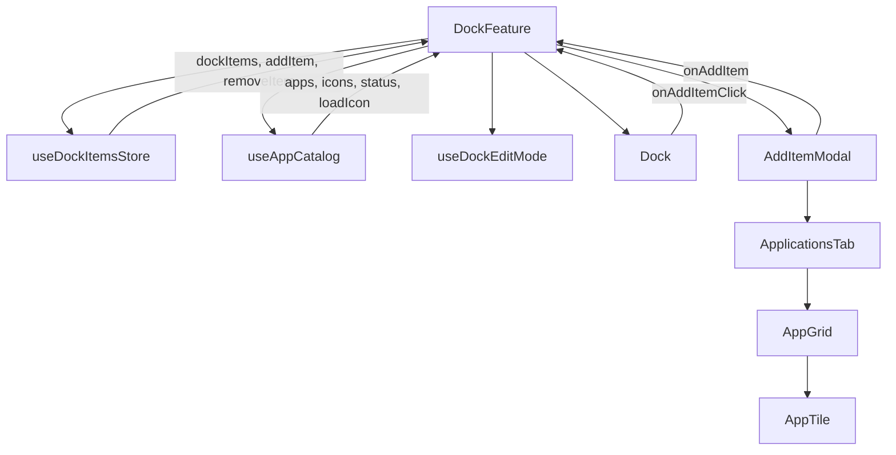
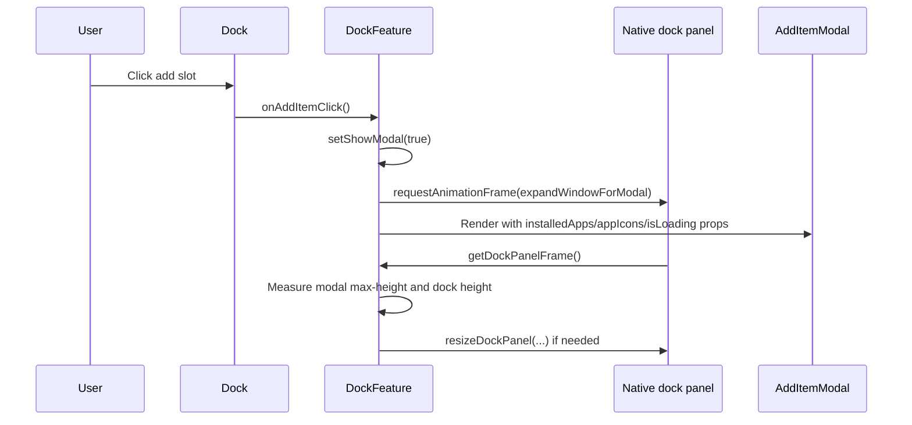
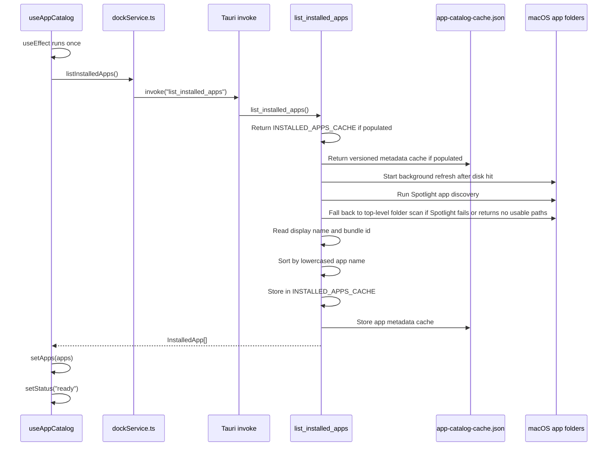
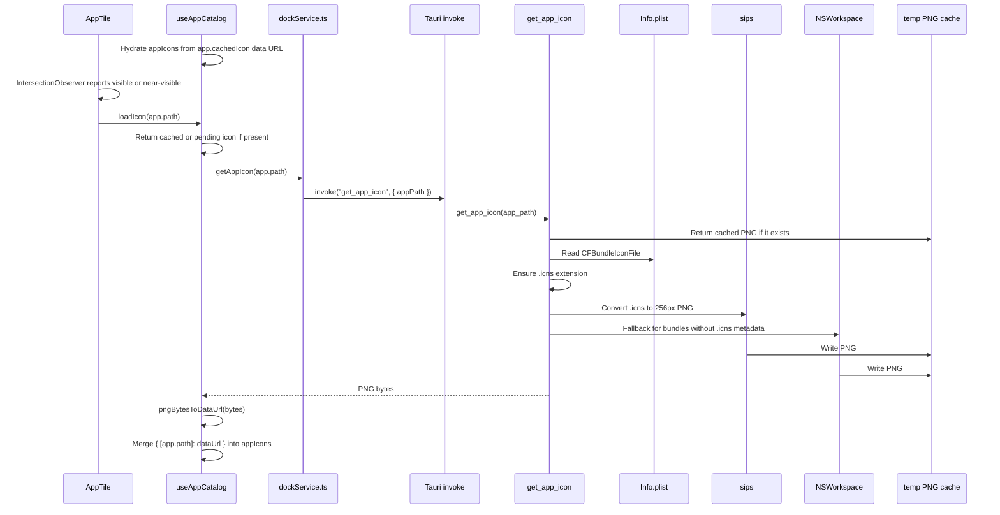
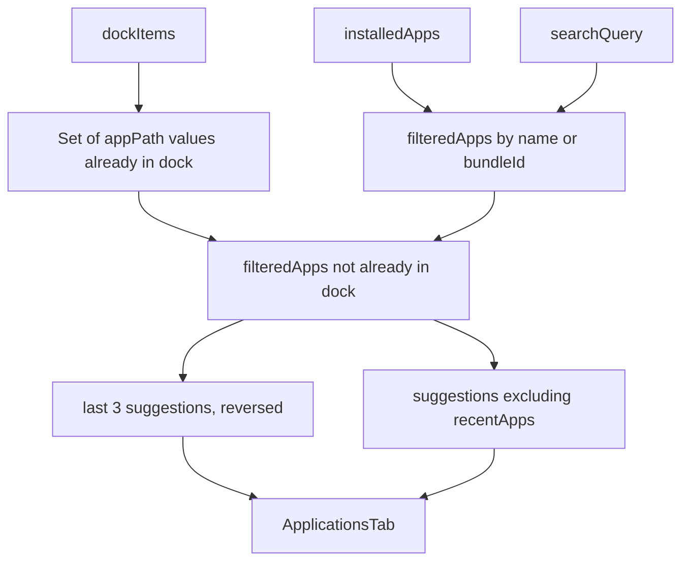
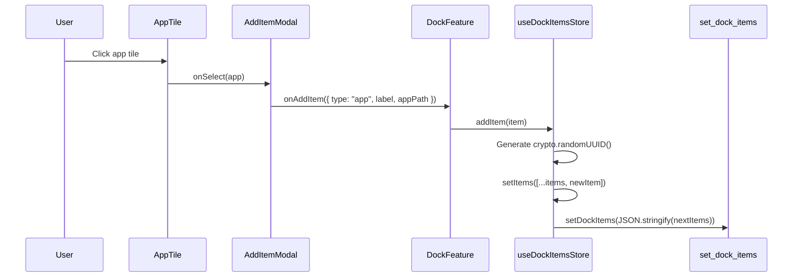

# Add Item Modal App Loading

This document captures how applications are currently loaded into the Add Item modal, how the pieces fit together, and the architectural idea behind the flow.

## Current Intent

The modal is meant to feel instant once the user enters dock edit mode and clicks the add slot. To support that, the app list is owned by `DockFeature`, not by the modal itself. `DockFeature` starts loading installed applications as soon as the feature mounts, then passes the latest list, icon map, and loading state into `AddItemModal`.

Icons are intentionally treated as progressive decoration: the modal can render the app names first, then each visible or near-visible tile asks the catalog for its icon.

## Proposed Refactor

The app list should become an App Catalog instead of a modal-specific loading routine. In this model, the catalog owns app discovery, refresh, cache state, and icon loading; the Add Item modal only consumes a snapshot and renders searchable choices.

Slice 1 is the completed baseline and kept behavior intentionally stable:

- Existing folder-scan discovery remains the source of app metadata.
- The frontend hook exposes catalog-shaped state: `apps`, `icons`, `status`, `error`, `refresh`, and `loadIcon`.
- Rust exposes `refresh_installed_apps`, which clears the current in-memory cache and rebuilds it with the existing scan.
- Frontend and Rust emit `[app-catalog]` timing logs so future slices can prove they improve real behavior.

Slice 2 moves icon loading out of the catalog preload path:

- The app list still loads eagerly through `useAppCatalog`.
- `loadIcon(appPath)` remains the only frontend icon-loading API.
- `AppTile` requests its icon with `IntersectionObserver` when the tile is visible or within a small prefetch margin.
- Existing fallback initials remain the loading and failure state.

Slice 3 lets cached icons travel with app rows without reintroducing eager extraction:

- `InstalledApp` can include a `cachedIcon` data URL when a PNG already exists in the native icon cache.
- `useAppCatalog` hydrates its `icons` map from that cached URL as soon as the app list resolves.
- `get_app_icon` still performs lazy extraction for cache misses and updates the in-memory app row after success.
- Rust checks the PNG cache before reading bundle metadata, so cached icons work even for apps without `CFBundleIconFile`.
- For bundles without a normal `.icns`, Rust falls back to macOS `NSWorkspace.iconForFile` through JXA and writes the result to the same PNG cache.

Slice 4 adds a persistent app metadata cache:

- `list_installed_apps` returns the in-memory catalog first, then a versioned disk cache when available, then the existing folder scan.
- Disk cache rows store app metadata only: name, path, and bundle ID. Cached icon data still comes from the separate PNG cache.
- When disk metadata is served, Rust starts a background folder-scan refresh and rewrites the disk cache for the next launch.
- `refresh_installed_apps` still forces an immediate folder scan and updates both memory and disk cache.

Slice 5 removes icon cache filename collisions:

- Native icon PNG cache filenames are keyed by a SHA-256 hash of the full app path.
- New cache keys are prefixed with `v2-` so the cache format can evolve safely.
- Existing filename-derived cache entries are read as a migration fallback and copied into the hashed cache path on first use.

Slice 6 makes Spotlight the primary app discovery source:

- `list_installed_apps` still returns memory first, then the versioned disk metadata cache, and only discovers apps on a cold cache miss.
- Disk metadata cache hits still trigger a background refresh so modal cold-start behavior stays fast.
- Native discovery now asks Spotlight with `mdfind "kMDItemContentTypeTree == 'com.apple.application-bundle'"`.
- Spotlight results are limited to supported app locations: `/Applications`, `/System/Applications`, `/System/Library/CoreServices/Applications`, and `~/Applications`.
- Discovered paths are normalized, must exist, must end in `.app`, and are deduped by canonical path when possible.
- If Spotlight fails or returns no usable app paths, Rust falls back to a conservative top-level folder scan of the same supported locations.
- Because Spotlight returns indexed bundles, the catalog can now include nested apps that the old top-level folder scan missed.

Later slices can change internals without changing the modal:

- Add directory watching or explicit refresh UI once the catalog is stable.

Baseline metrics to compare before and after each slice:

- `list_installed_apps` duration and app count.
- `refresh_installed_apps` duration and app count.
- first modal open-to-render duration.
- first app list ready duration.
- visible icon request timings and total icon load behavior.

## Main Files

| Concern | File |
| --- | --- |
| Feature owner and modal mounting | `src/features/dock/DockFeature.tsx` |
| App catalog hook | `src/features/dock/hooks/useAppCatalog.ts` |
| Tauri IPC wrapper | `src/features/dock/services/dockService.ts` |
| Add Item modal shell | `src/features/add-item/AddItemModal.tsx` |
| Applications tab | `src/features/add-item/tabs/ApplicationsTab.tsx` |
| App grid | `src/features/add-item/components/AppGrid.tsx` |
| App tile | `src/features/add-item/components/AppTile.tsx` |
| Shared dock types | `src/features/dock/types.ts` |
| Native app listing and icon commands | `src-tauri/src/lib.rs` |

## Frontend Ownership

`DockFeature` is the coordinator:

- It calls `useAppCatalog()` at render time, so app loading is independent of whether the modal is currently visible.
- It tracks `showModal` locally and only renders `AddItemModal` when the dock is in edit mode and the add slot has been clicked.
- It passes `installedApps`, `modalAppIcons`, `appsLoading`, and `loadIcon` to the modal as props.
- It keeps the add operation centralized through `handleAddItem`, which calls `useDockItemsStore().addItem`.

## Open Modal Flow

The panel resize is tied to modal opening rather than app loading. `expandWindowForModal` reads the modal CSS `max-height` instead of relying on `scrollHeight`, because icons and content can arrive asynchronously after the first render.

## Installed App List Loading

Current native behavior:

- App discovery is Spotlight-first through `mdfind`, which can return nested indexed application bundles.
- Spotlight results are filtered to `/Applications`, `/System/Applications`, `/System/Library/CoreServices/Applications`, and `~/Applications`.
- App paths are normalized before rows are built: paths must exist, must have an `.app` extension, and are deduped by canonical path when possible.
- If Spotlight fails or returns no usable app paths, Rust falls back to a top-level folder scan of the supported app locations.
- Display names come from Spotlight metadata first via `mdls kMDItemDisplayName`.
- If Spotlight does not provide a name, Rust falls back to `CFBundleDisplayName`, then `CFBundleName`, then a filename-derived fallback.
- Bundle IDs come from `CFBundleIdentifier`, falling back to the safe filename.
- Results are cached in process memory in `INSTALLED_APPS_CACHE`.
- App metadata is also cached in `~/Library/Application Support/workspace-dock/app-catalog-cache.json`.
- Disk metadata cache stores only name, path, and bundle ID; icons remain in the PNG cache.
- When disk metadata is used, Rust refreshes discovery in the background and saves the updated metadata for the next launch.
- `refresh_installed_apps` clears the in-memory cache and rebuilds memory plus disk cache with the same discovery flow.

## Icon Loading

Frontend icon behavior:

- `isLoading` becomes `false` as soon as the app list is available, not when icons are done.
- If the app list includes `cachedIcon`, `useAppCatalog` adds it to the icon map immediately.
- Icons load only when an `AppTile` is visible or within the observer prefetch margin.
- `loadIcon(appPath)` dedupes pending requests, so duplicate tile renders do not create duplicate IPC calls for the same path.
- The modal icon map is keyed by app path: `Record<string, string>`.
- `AppTile` uses the icon URL when present.
- If an icon is not loaded, still pending, or fails, `AppTile` shows a two-letter fallback generated from the app name.

Native icon behavior:

- Rust returns the cached PNG first when it exists.
- On cache miss, Rust reads `CFBundleIconFile` from the app bundle's `Info.plist` and converts the `.icns` file with `sips -s format png -Z 256`.
- If the bundle does not expose a normal `.icns`, Rust falls back to macOS `NSWorkspace.iconForFile` and writes that PNG into the same cache.
- Converted PNGs are stored under the temp directory in `workspace-dock-icons`.
- The cache filename uses a `v2-` SHA-256 hash of the full app path.
- Old filename-derived cache files are read as a one-time migration fallback and copied into the hashed cache location.

## Modal Filtering And Sections

`AddItemModal` owns tab state and search state:

- `activeTab` defaults to `applications`.
- `searchQuery` is shared with `ApplicationsTab`.
- Filtering is case-insensitive across `app.name` and `app.bundleId`.
- Apps that are already present in the dock are removed by comparing `InstalledApp.path` with each app dock item's `appPath`.
- `recentApps` is currently the last three suggestion entries reversed. This is not true usage recency yet.
- `suggestionApps` contains the remaining suggestion entries.

`ApplicationsTab` is purely presentational:

- It renders the search row.
- If `isLoading` is true, it shows `Loading applications...`.
- Once loading is false, it renders Suggestions and, when non-empty, Recents.

## Add App Flow

Selecting an application adds it to the dock and leaves the modal open. The newly added app disappears from the application suggestions because the modal receives the updated `dockItems` array and recomputes `dockAppPaths`.

## Architecture Idea

The current design separates the problem into three layers:

1. Native discovery layer: Rust knows how to scan macOS application bundles and extract names, bundle IDs, and icons.
2. IPC service layer: `dockService.ts` exposes small typed wrappers around Tauri commands.
3. UI composition layer: React owns loading state, filtering, presentation, and persistence into dock items.

That split keeps macOS-specific filesystem and command-line work out of components while keeping the modal simple. The modal does not know how to discover apps; it only receives a list and renders add choices.

The hook-based preload is the key idea. The app list is not requested on each modal open. Instead, `useAppCatalog` runs once per frontend session, and Rust has process-level and disk-backed app-list caches. This gives three cache layers:

- React cache: `apps`, `icons`, and `status` live in component state for the current WebView session.
- Rust cache: `INSTALLED_APPS_CACHE` prevents repeated filesystem scans during the app process.
- Disk metadata cache: `app-catalog-cache.json` gives a fast cold-start app list and is refreshed in the background after use.

## Current Limitations

- The installed app list has a refresh command, but no visible refresh UI yet.
- Directory scanning is not recursive, so apps nested in subfolders are missed.
- `recentApps` is not based on actual app usage or recently installed apps.
- The modal says "Drag an item into the dock", but app tiles are currently click-to-add.
- The view toggle button is presentational and not wired to alternate layout state.
- App list loading failure is stored in catalog state, but the modal does not surface it yet.
- `get_app_icon` failures are handled per icon, but there is no user-visible indication beyond fallback initials.

## Likely Next Directions

- Add an explicit refresh UI that calls the existing catalog refresh command.
- Add recursive app discovery for common nested app folders.
- Replace pseudo-recents with real recent installs, recent launches, or user-added history.
- Wire the view toggle to switch between grid and list views.
- Add drag-to-dock behavior if the footer hint is meant to become real.
- Surface discovery errors in the modal instead of silently showing an empty state.
