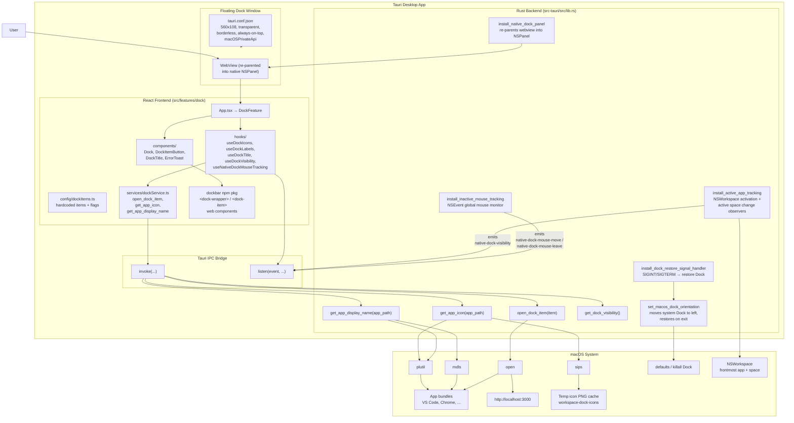
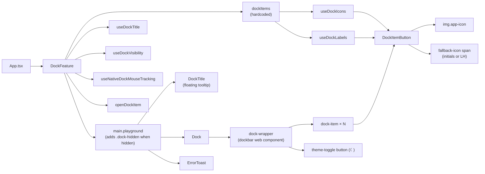
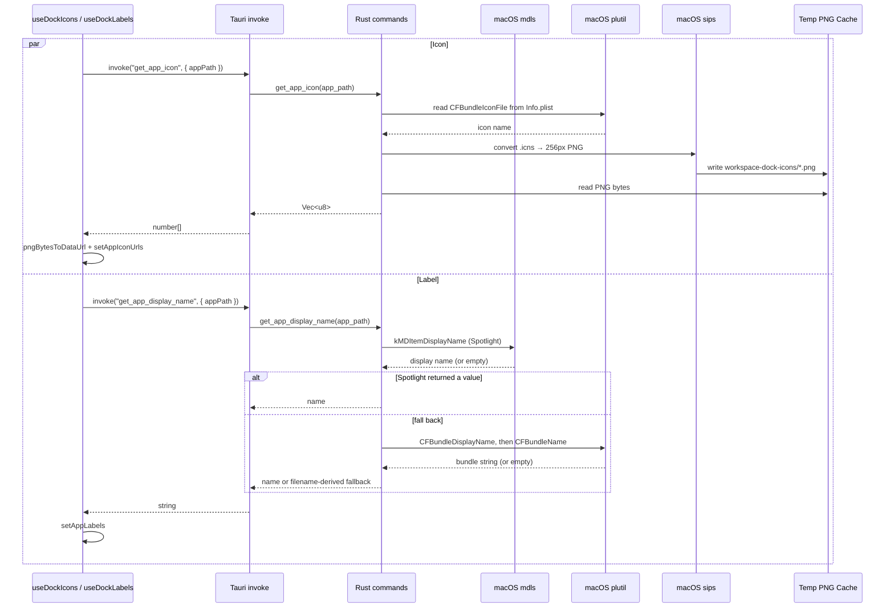
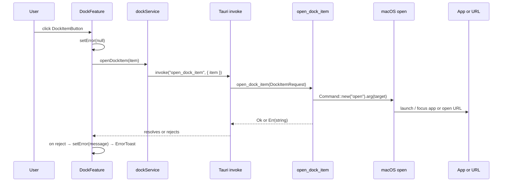
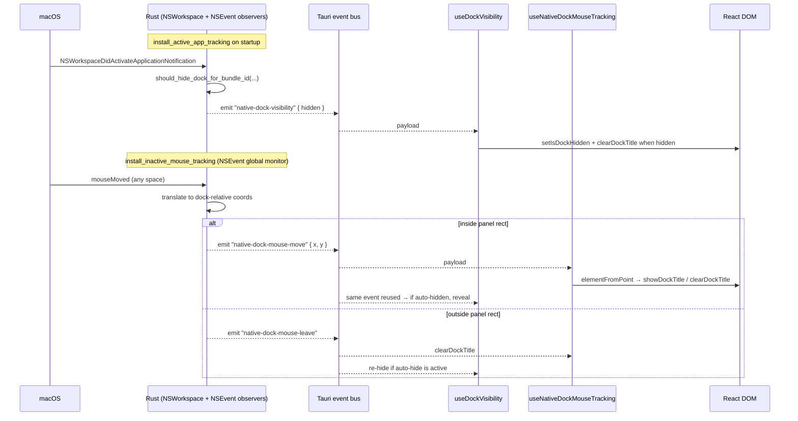
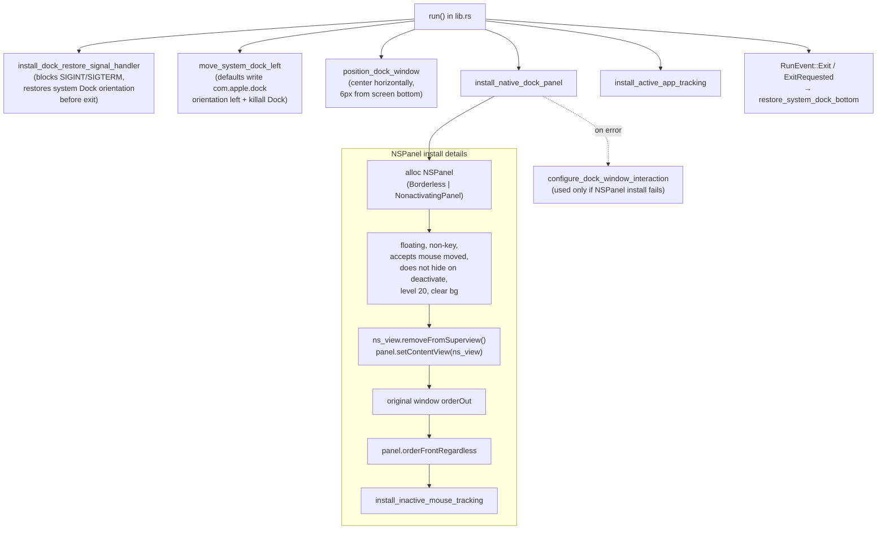

# Workspace Dock Architecture

This document describes the current state of the app: a Tauri + React floating dock that hosts a hardcoded list of items, runs as a native macOS `NSPanel`, and auto-hides based on which app is frontmost.

## High-Level App Shape



## Frontend Component And State Flow



## App Icon and Label Loading



## Launch Data Flow



## Dock Auto-Hide (Native Tracking)

The dock window is shown only when the frontmost app is **Finder** or **Workspace Dock** itself; for any other foreground app the React layer applies `.dock-hidden` (CSS slides it off-screen). Native mouse-move events let the dock react to hover even though it lives in an `NSPanel` that doesn't take focus.



## Native macOS Window Setup

The dock isn't a normal Tauri window. On startup the Rust setup re-parents the WebView into a custom `NSPanel` so it can float above all spaces without stealing focus, and tweaks the system Dock so the user has free vertical real estate.



## Current Boundaries

```mermaid
flowchart TB
  Hardcoded["Hardcoded today"]
  Future["Not yet implemented"]

  Hardcoded --> H1["src/features/dock/config/dockItems.ts<br/>3 fixed items: VS Code, Chrome, localhost:3000"]
  Hardcoded --> H2["enableDockMagnification flag (currently false)"]
  Hardcoded --> H3["theme-toggle button is decorative<br/>(no theme switching wired up)"]
  Hardcoded --> H4["Auto-hide rule: visible only when<br/>Finder or this app is frontmost"]

  Future --> F1["Persistent storage for items<br/>(no JSON / Tauri store yet)"]
  Future --> F2["Add / edit / remove / reorder items in UI"]
  Future --> F3["Multiple workspaces"]
  Future --> F4["Folder and Link item types<br/>(types.ts only has app and url)"]
  Future --> F5["App picker / file picker / URL input"]
  Future --> F6["Drag-and-drop into the dock from a modal<br/>(dockbar web component already supports sortable)"]
```



## Type Model (current)

```ts
// src/features/dock/types.ts
type AppDockItem = { id: string; type: "app"; label: string; appPath: string };
type UrlDockItem = { id: string; type: "url"; label: string; url: string };
type DockItem    = AppDockItem | UrlDockItem;
type DockTitle   = { label: string; left: number; top: number };
```

Rust mirrors this with `DockItemRequest::App { app_path }` / `DockItemRequest::Url { url }` (camelCase serde tag).

## Key Files

| Concern | File |
| --- | --- |
| Entry | [src/main.tsx](src/main.tsx), [src/App.tsx](src/App.tsx) |
| Feature root | [src/features/dock/DockFeature.tsx](src/features/dock/DockFeature.tsx) |
| Item config | [src/features/dock/config/dockItems.ts](src/features/dock/config/dockItems.ts) |
| Components | [src/features/dock/components/](src/features/dock/components/) |
| Hooks | [src/features/dock/hooks/](src/features/dock/hooks/) |
| IPC client | [src/features/dock/services/dockService.ts](src/features/dock/services/dockService.ts) |
| Styling | [src/features/dock/dock.css](src/features/dock/dock.css), [src/App.css](src/App.css) |
| Web component types | [src/custom-elements.d.ts](src/custom-elements.d.ts) |
| Rust backend | [src-tauri/src/lib.rs](src-tauri/src/lib.rs) |
| Window config | [src-tauri/tauri.conf.json](src-tauri/tauri.conf.json) |
