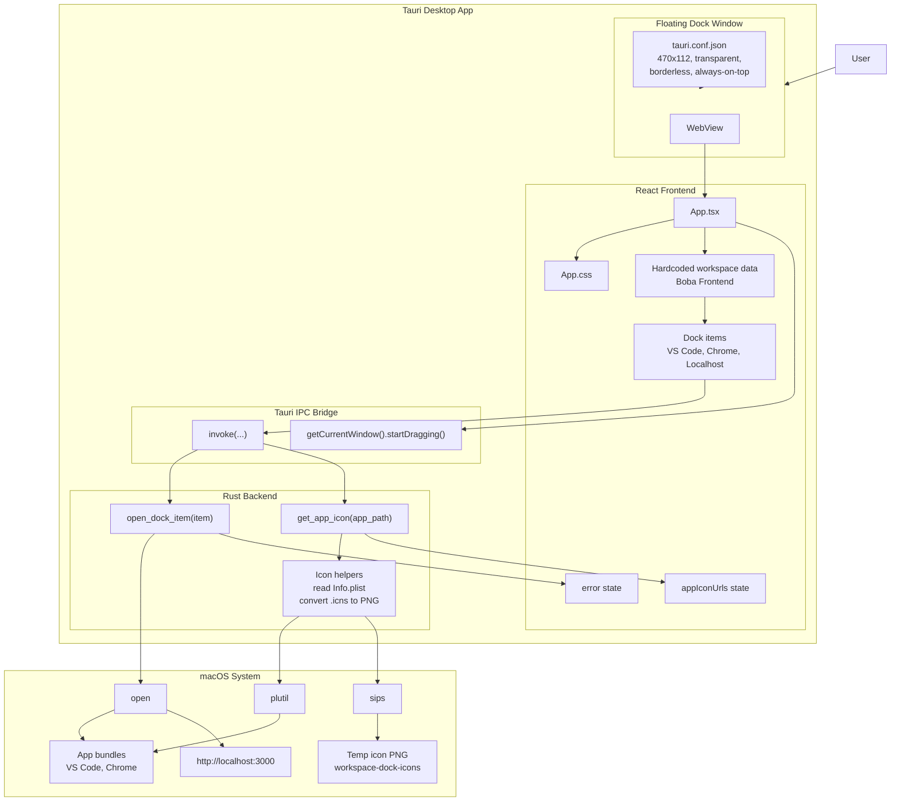
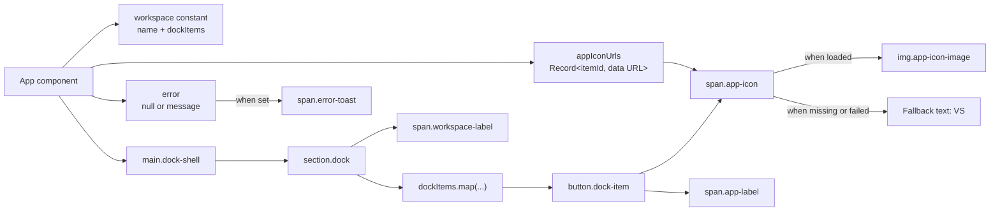
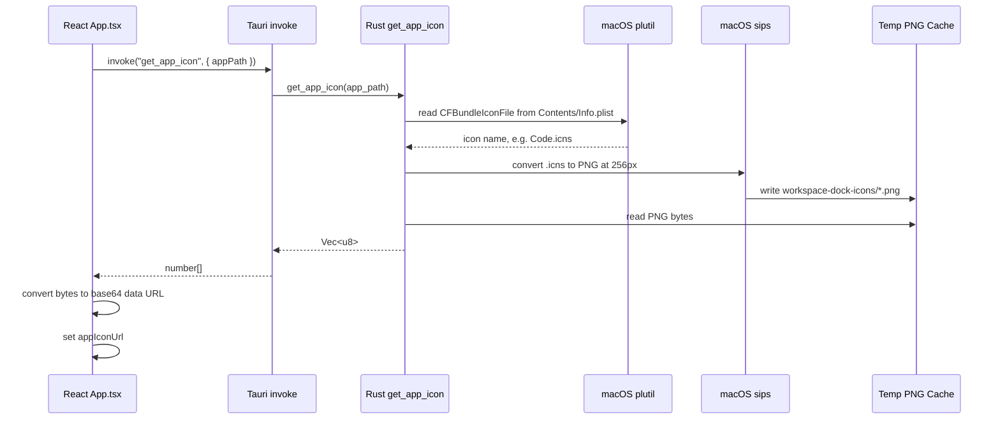
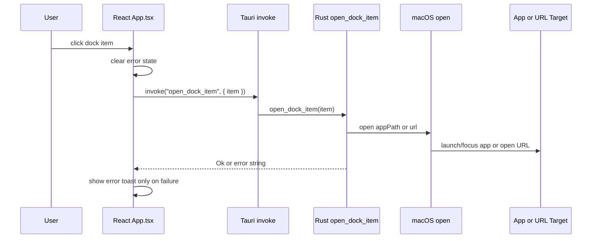
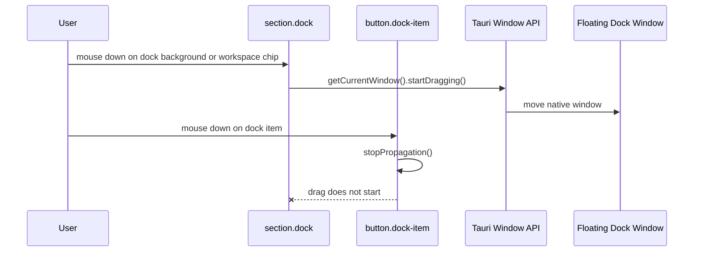
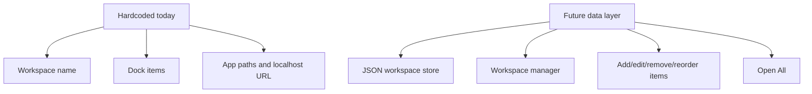

# Workspace Dock Architecture

This document describes the current MVP slice: one floating Tauri dock with one hardcoded workspace and three dock items.

## High-Level App Shape

## Frontend Component And State Flow

## App Icon Loading Data Flow

## Launch Data Flow

## Drag Data Flow

## Current Boundaries

Current storage is still hardcoded in `src/App.tsx`. The next architectural step is to move workspace data behind a store command or frontend store module before adding workspace creation and item management.
